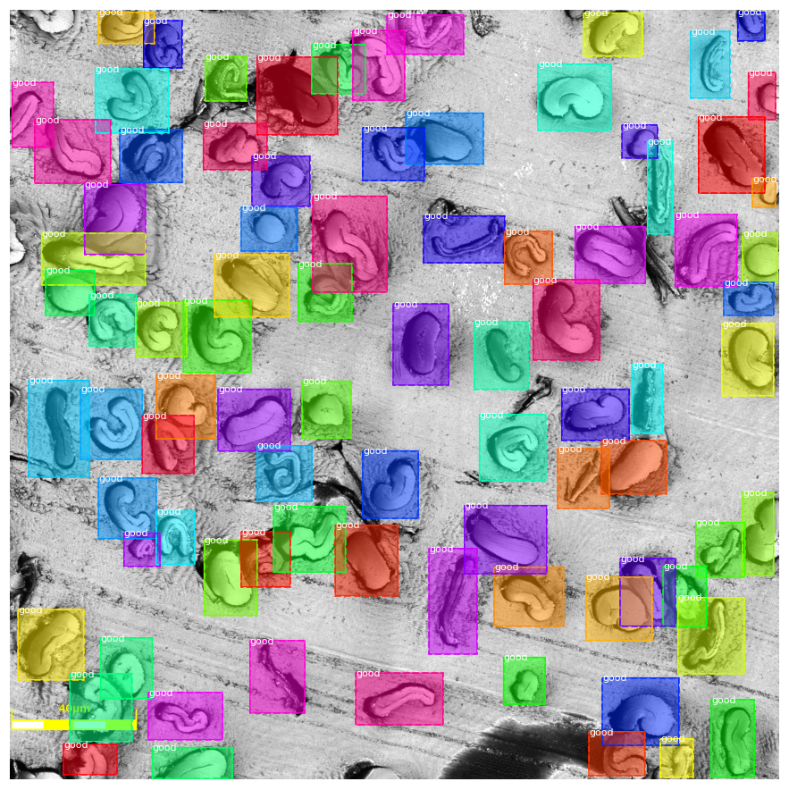
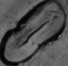

# Cotton Lumen Light Microscopy 
## Description

This project is for detecting cotton fiber cross-sections, classifying 'bad' vs 'good' fibers and ultimately measuring morphological traits.

<p align="center">
	
</p>


Mask RCNN can be used for this, but annotations are required for even the bad fibers. With this in mind, we decided to use a three step algorithm that simplifies the annotation process.

* Detection: annotate dataset with bounding boxes, create ROI for all good and bad fibers, train a RCNN model to detect these objects.

* Classification: partition the output of Detection into two folders 'good' and 'bad', train a CNN model to classify 

* Measure: further annotate the 'good' output with masks and train another Mask RCNN model to accurately detect areas 

## Project setup

There are many ways to manage python and it's modules, this setup shows one way.

I use anaconda to handle virtual environments, a way to organize modules for different projects without needing system privilidges or destroying local workflows. https://www.anaconda.com/

Once installed, open the anaconda shell and create a new virtual environment:

This command creates a new environment named 'cotton-gpu' that uses python 3.6 (very important!)

```conda create -n cotton-gpu python=3.6```

Activate the environment

```conda activate cotton-gpu```

Further commands in this guide assume this environment is activated, unless otherwise stated.

A Mask RCNN library is included in this project, navigate to it's folder and run the following:
```
pip install -r requirements.txt
python setup.py install
```

Using tensorflow gpu requires an Nvidia GPU using Cuda toolkit 8.0 and cudaNN 6.0.0. 
You must use these versions exactly for tensorflow 1.4.0 which this project requires.

Toolkit installation will vary for OS, and CudaNN files must be manually dropped into the toolkit respective bins.

https://developer.nvidia.com/downloads

Install all required pip files
```
pip install h5py==2.10.0
pip install imgaug==0.4.0
pip install ipykernel==5.5.6
pip install ipython==7.16.3
pip install keras==2.0.8
pip install matplotlib
pip install numpy==1.19.5
pip install opencv-python
pip install pandas
pip install Pillow
pip install scikit-image==0.16.2
pip install scikit-learn==0.24.2
pip install scipy

#important notice the -gpu if you want to use your GPU, remove if not (but it will be very slow)
pip install tensorflow-gpu==1.4.0

pip install git+https://github.com/keras-team/keras-preprocessing.git
```

To use the kernel in an ipython notebook (used a lot across this project) install:

``` ipython kernel install --user --name=cotton-gpu ```

## Weights
Models are trained and the weight files used in the below scripts can be found here: 
https://clemson-my.sharepoint.com/:f:/g/personal/ccourtn_clemson_edu/ErB1ZDSbCi9Nm0DksYqtsekBbyJuYQ579uQVs3FDCWMdMQ?e=xfqKbY

You need to use clemson account and have access to this link.
cotton20221215T2314.zip are the detection weights
weights.zip are the measure weights

## Detection

<p align="center">
	
</p>

VGG's tool VIA is used for annotation:
https://www.robots.ox.ac.uk/~vgg/software/via/via.html

Datasets with a source folder will have an accompanying json project file that can be imported into this tool which will resume annotation. Images in the source folder must also be uploaded when resuming. When working with annotation projects, I always export all available json files Annotation>Export Annotations (as csv or json or COCO). This project uses the json annotation for bbox detection.

Annotating bboxes only requires the user to select the rectangle region shape, and start drawing rectangles around the objects. Make sure to create bboxes for all shapes, good or bad. I usually bbox objects that are partially visible on the sides of the image.

<p align="center">
	
</p>

The python notebook under Mask_RCNN/samples/cotton/inspect_cotton_data.ipynb can be used to display the image above. This is a great tool for ensuring annotations are loaded correctly. Read the configuration node and ensure the correct dataset folder is chosen. The dataset must have a folder named "all" that has an annotation file named "cotton.json".

* Inputs: HD images with good and bad fibers, annotation file with bboxes for each object to detect
* Outputs: a new dataset of single images per fiber partitioned into a good or bad folder
* Method:
	* Create a directory for your dataset e.g dataset_Alpha-B-5-1, create subdirs 'all', 'train', and 'val'.
		* 'all' folder should have every image, 'train' and 'val' should split the dataset 
		* use VIA to annotate each folder, I usually just annotate the all folder, export annotations into all, then reimport and delete respective images to create train and val annotations. Train and val MUST have annotations files as well! Rename the json export to "cotton_bboxes.json" for each directory.
	* Convert bbox json annotations to mask annotations. Mask RCNN does not accept bbox annotations, so they must be converted into masks, I have a script for this under Mask_RCNN/samples/cotton/bbox_to_mask.ipynb.
		* Adjust the script subset variable to point to the folder you are using. Run the script, this will change the annotations to masks and create a new json file "cotton.json", do not change the name.
	* Now train Mask_RCNN by running 

		```
		python Mask_RCNN/samples/cotton/cotton.py train --dataset=/path/to/cotton_dataset --weights=coco

		```
		
		Fill in the dataset parameter with your project directory path. More information at 
		https://github.com/matterport/Mask_RCNN but notices the --weights flag is different from the default --model flag.

		This could take multiple hours to complete depending on your system.

<p align="center">
	
</p>

The image above shows a network inference result, NOT annotations. Notice some fibers have been missed. Notice all labels are "good" this doesn't really mean good/bad fiber yet this model is solely for detection.

Finally, use detection_output.ipynb in samples folder to load the model and output a folder of individual fibers based on inference.

## Classification

Classification uses transfer learning on Xception, a CNN model: https://arxiv.org/abs/1610.02357
There are many available pretrained networks that can be experimented with, I found Xception to work well enough: https://keras.io/api/applications/

Inputs: a dataset of images with single fibers. Directory structure should have an "fibers" folder that contains all images, a "good" folder that contains all good fibers, and a "bad" folder that contains all bad images.

Outputs: a mapping from individual image/fiber to a score for each class 'good' or 'bad' e.g { image1 : [0.1, 0.9] } would mean the classifer is 10% sure its bad but 90% its good.

Method:

* For generating the "fibers" folder from annotations you can use my Mask_RCNN/samples/cotton/bbox_annotations_to_dataset.ipynb. This will read the bbox annotation file and generate single images for each bbox inside the "fibers" folder. Or for generating with model inference use the detection_output.ipynb.

* With your fibers folder, manually create a bad/good folder and place your images in them respectively.

* Use the train_kfold_cotton_classifier_model.ipynb to train the classifier. 

<p align="center">
	
	
</p>

If you've already trained a model, use classify_output.ipynb in samples to load your model and run for each individual fiber and fill good/bad folders.

## Measure

Measuring is very similar to the Detection step. Use VIA annotator with the output of the Classification step to annotate accurate masks of the good fibers. Train the model using Mask RCNN with new weights (don't use pretrained model from Detection step). 

<p align="center">
	
	
</p>

Use dcm_model.ipynb to use the full algorithm. As seen below, blue boxes show detections. The ones annotated with masks are the objects the classification model deems 'good', these are also annotated with areas in pixels for the entire mask.

<p align="center">
	
</p>

## Future To Do's
More data and more annotations will help the entire process. Detection is decent already but fine-tuning the annotations to have more accurate bboxes would be good. The classification model is just ok right now. I think the problem is too complicated to have a binary good/bad class and the training would enhance if we expand the number of classes into a vector or ranking. The mask output is pretty good but not perfect yet, this was only trained on 200 out of 500 of our good objects so that would be an easy way to improve the current state.
